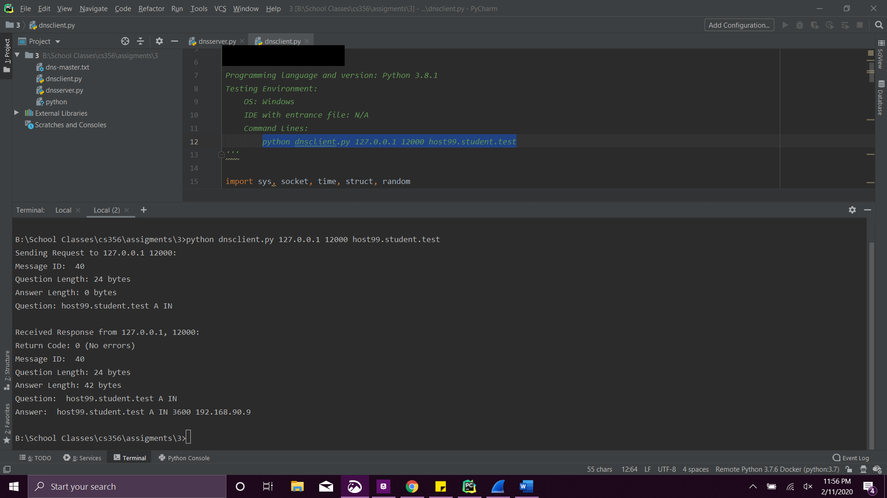
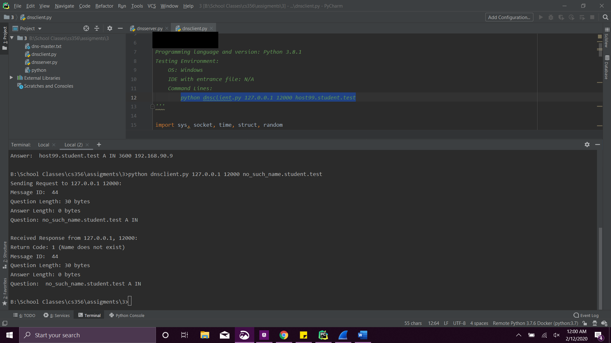
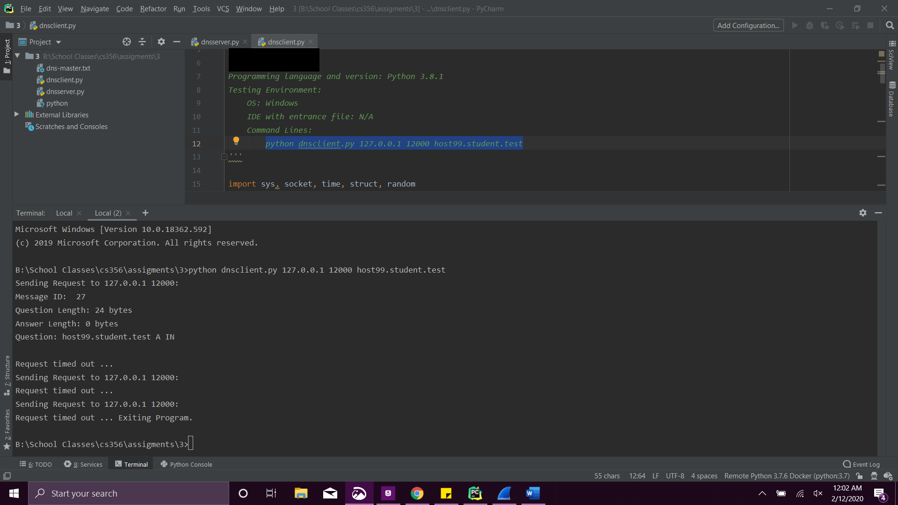

# dns
_This project is from my networking class and the requirements belong to my professor_

The program uses UDP sockets to show a simplified version of a DNS client and server. The server is
responsible for the domain “student.test”. The client will send a request to the server to look up the IP
address of a specified host in that domain, and the server responds with the type A resource record
associated with the host.

The client performs the following functions:

1. Reads in 3 arguments from the command line:\
a. IP address of server (127.0.0.1)\
b. Port of server\
c. Hostname (e.g. host1.student.test)
 

2. Sends a request with the specified hostname to the server using the message format specified

3. Waits for a response using a 1 second timeout period.\
a. If a response arrives within the timeout period, prints out the server response as shown in
this document
b. If not, re-sends the message (same sequence number) for a maximum of 3 attempts before
printing an applicable message and exiting\

The server performs the following functions:
1. Reads in 2 arguments from the command line:\
a. IP address of server (127.0.0.1)\
b. Port of server
 

2. Reads in the master file named “dns-master.txt”

3. Stores the resource records (type A) in data structures in main memory suitable for searching

4. Responds to requests from the DNS client for hostname in the domain using the message format
specified

5. Returns an error if the name queried does not exist in the domain.

## Test cases
#### Hostname is found

 

#### Hostname is not found

 

#### Server does not respond
